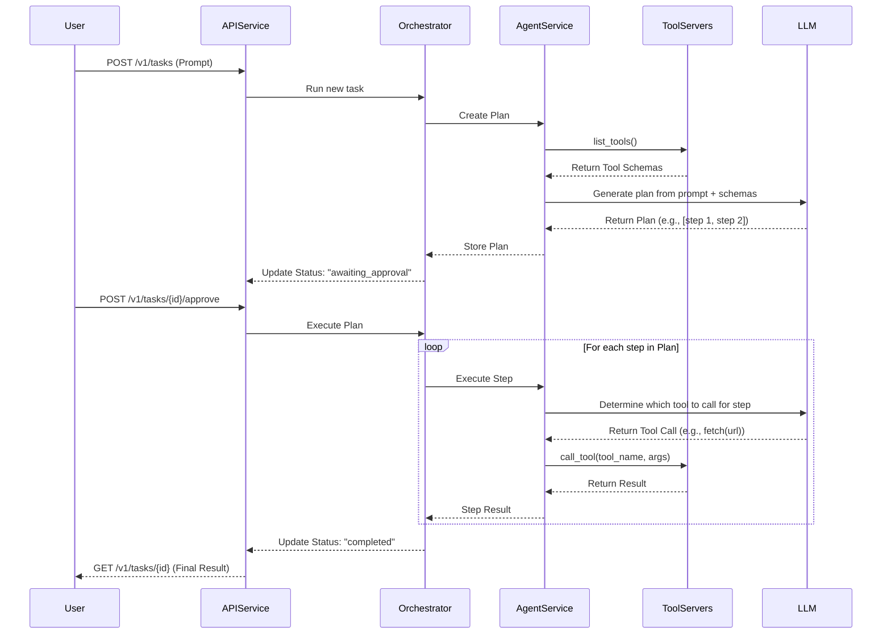

# MCP Agent Service - Plan and Execute

This project provides a modular, asynchronous, task-based service for orchestrating sophisticated AI agents. It uses a **Plan and Execute** model with human-in-the-loop approval, allowing agents to tackle complex, multi-step tasks by first creating a plan, awaiting human consent, and then executing that plan step-by-step.

## Architecture

The system follows a structured, asynchronous process to handle user requests.



## Core Components

1.  **API Service (`api/`)**: A FastAPI server that exposes a versioned API for task management.
2.  **Orchestration (`services/orchestrator.py`)**: Manages the entire lifecycle of a single task, from planning to execution.
3.  **Agent Service (`services/agent_service.py`)**: Defines the `PlannerAgent` (creates the plan) and the `ExecutorAgent` (executes the plan).
4.  **Tool Registry (`services/tool_registry.py`)**: Manages the lifecycle of all MCP servers (local or remote) that provide tools to the agents.
5.  **Tool Manager (`services/tool_manager.py`)**: Automatically discovers and installs dependencies for local tools defined in the tool registry.

## Setup & Usage

This project uses Poetry for dependency management.

**1. Create Your Local Configurations:**

You need to create two local configuration files from the provided templates. These files are gitignored, so your private keys and tool configurations will not be committed.

-   **Copy `config.template.yaml` to `config.yaml`:**
    ```bash
    cp config.template.yaml config.yaml
    ```
    -   Edit `config.yaml` and add your OpenAI API key.

-   **Copy `tool_registry.template.yaml` to `tool_registry.yaml`:**
    ```bash
    cp tool_registry.template.yaml tool_registry.yaml
    ```
    -   Edit `tool_registry.yaml` to add your private remote tools (e.g., Notion, Gmail). The public `filesystem` and `fetch` tools are already included.

**2. Install Python Dependencies:**
```bash
poetry install
```

**3. Run the Server:**
```bash
poetry run start
```
When you run the server, the `ToolManager` will automatically inspect your `tool_registry.yaml` and install any required `npm` packages for the local tools.

## Interacting with the API

Here is an example workflow using `curl` and `jq`.

**1. Submit a task to generate a plan:**
```bash
TASK_ID=$(curl -s -X POST "http://127.0.0.1:8000/v1/tasks" \\
-H "Content-Type: application/json" \\
-d '{
  "prompt": "Read the URL from ''composer_core/sample_data/url_to_fetch.txt'' and then fetch the content of that website."
}' | jq -r .task_id)

echo "Task submitted with ID: $TASK_ID"
```

**2. Check status until awaiting approval:**
```bash
# Poll until the status is 'awaiting_approval'
while true; do
  STATUS_INFO=$(curl -s "http://127.0.0.1:8000/v1/tasks/$TASK_ID")
  STATUS=$(echo "$STATUS_INFO" | jq -r .status)
  echo "Current status: $STATUS"
  if [ "$STATUS" == "awaiting_approval" ]; then
    echo "Plan is ready for approval:"
    echo "$STATUS_INFO" | jq .plan
    break
  elif [ "$STATUS" == "failed" ]; then
    echo "Task Failed:"
    echo "$STATUS_INFO" | jq .
    exit 1
  fi
  sleep 2
done
```

**3. Approve the plan:**
```bash
curl -s -X POST "http://127.0.0.1:8000/v1/tasks/$TASK_ID/approve"
echo "\\nPlan approved. Waiting for execution..."
```

**4. Check the final result:**
```bash
# Wait for the agent to execute...
sleep 10

echo "\\nFinal Task Status:"
curl -s "http://127.0.0.1:8000/v1/tasks/$TASK_ID" | jq .
```

## Testing

To run a full, end-to-end test that starts the server and makes a real request, use the test script in the `MCPschema_check` directory.

```bash
poetry run python MCPschema_check/comprehensive_e2e_test.py
```
This script now serves as the primary end-to-end test. 