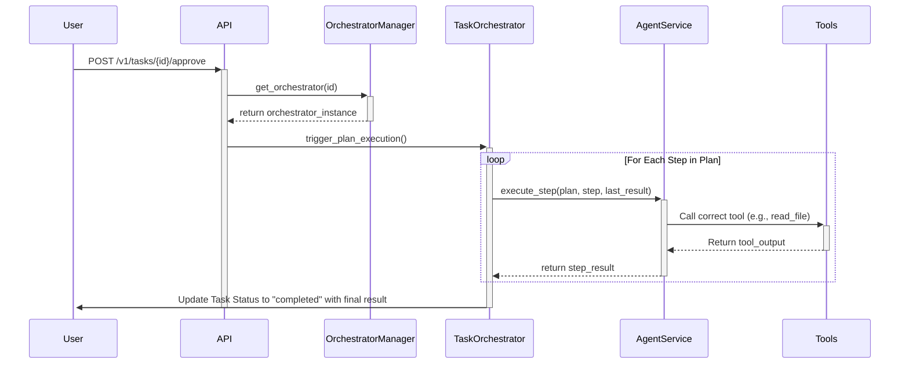

```mermaid
sequenceDiagram
    participant User
    participant API
    participant OrchestratorManager
    participant TaskOrchestrator
    participant AgentService
    participant Tools

    User->>+API: POST /v1/tasks/{id}/approve
    API->>+OrchestratorManager: get_orchestrator(id)
    OrchestratorManager-->>-API: return orchestrator_instance
    API->>+TaskOrchestrator: trigger_plan_execution()
    
    loop For Each Step in Plan
        TaskOrchestrator->>+AgentService: execute_step(plan, step, last_result)
        AgentService->>+Tools: Call correct tool (e.g., read_file)
        Tools-->>-AgentService: Return tool_output
        AgentService-->>-TaskOrchestrator: return step_result
    end

    TaskOrchestrator->>+User: Update Task Status to "completed" with final result
    deactivate TaskOrchestrator
    deactivate API
``` 